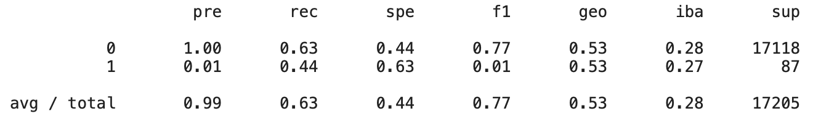
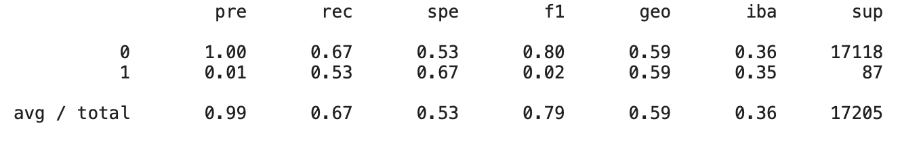
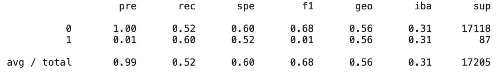
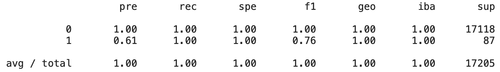
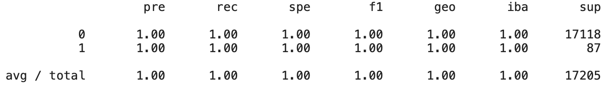

# Overview
The purpose of this analysis is to Employ Supervised Machine Learning Techniques in order to assess Credit Risk. Assessing credit risk is characteristically tricky because low risk loans are vastly outnumber by risky loans. So, To account for this I will be testing six different approaches to predict credit risk utilizing a dataset provided by LendingClub, a peer-to-peer lending service.

After we get the results, I will review the performance of each model and arrive at a recommendation whether any of the models are suitable for use.

# Results
Below are the results of the balanced accuracy scores and imbalanced classification reports for each machine learning model I tested:

## Oversampling

#### 1. Random Oversampling
-	Balanced Accuracy Score: 0.535
-	Recall Score, based on Imbalanced Classification Report:

#### 2. SMOTE
-	Balanced Accuracy Score: 0.598
-	Recall Score, based on Imbalanced Classification Report:

## Undersampling

#### 3. Undersampling
-	Balanced Accuracy Score: 0.559
-	Recall Score, based on Imbalanced Classification Report:

##Combination Over/Under Sampling

#### 4. SMOTEENN
-	Balanced Accuracy Score: 0.608
-	Recall Score, based on Imbalanced Classification Report:

## Ensemble Learners 

#### 5. Balanced Random Forest Classifier
-	Balanced Accuracy Score: 0.998
-	Recall Score, based on Imbalanced Classification Report:

#### 6. Easy Ensemble AdaBoost Classifier
-	Balanced Accuracy Score: 1.0
-	Recall Score, based on Imbalanced Classification Report:

# Summary
Our ideal model will balance accuracy and recall, or sometimes referred to as sensitivity. While a high score in each area would indicate that the model is a strong predictor of credit risk, we may want to drill down into sensitivity on both low- and high-risk loans. Depending on the needs of the business, stakeholders might have a higher tolerance for either a more conservative model or one that is a little riskier.

-	In our first model the Random Oversampling, the results returned a Balanced Accuracy Score of 0.535 and a total recall score of 0.63.
-	SMOTE (Synthetic Minority Oversampling Technique) Oversampling returned a Balanced Accuracy Score of 0.598 and a total recall score of 0.67.
-	Undersampling returned a Balanced Accuracy Score of 0.559 and a total recall score of 0.52.
-	SMOTEENN returned a Balanced Accuracy Score of 0.608 and a total recall score of 0.57
-	In our Balanced Random Forest Classifier model returned a Balanced Accuracy Score of 0.998 and a total recall score of 1.00.
-	Finally, the Easy Ensemble AdaBoost Classifier model returned a Balanced Accuracy Score of 1.0 and a total recall score of 1.0.

## Recommendations
Based on our findings above, I recommend the East Ensemble AdaBoost Classifier model due to the model’s high accuracy and sensitivity/recall performance. This model will accurately predict credit risk for both high- and low-risk loans.
